# 3DCV HW2 Report

- Student: 詹勳澔
- ID: R13922122

## Table of Contents

- [3DCV HW2 Report](#3dcv-hw2-report)
  - [Table of Contents](#table-of-contents)
  - [Overview](#overview)
  - [Demonstration Video Link](#demonstration-video-link)
  - [Declaration](#declaration)
    - [AI Tools Used](#ai-tools-used)
    - [Discussion with Peers](#discussion-with-peers)
  - [Environment](#environment)
    - [Dependencies for Problem 2](#dependencies-for-problem-2)
    - [Environment Creation](#environment-creation)
  - [Usage](#usage)
    - [Individual Execution](#individual-execution)
  - [Report for Problem 1](#report-for-problem-1)
    - [Steps](#steps)
    - [Difficulties Encountered](#difficulties-encountered)
  - [Report for Problem 2](#report-for-problem-2)
    - [Steps](#steps-1)
    - [Difficulties Encountered](#difficulties-encountered-1)

## Overview

For problem 2, this project implements a PnP with RANSAC pipeline, and places a virtual 3D cube in the validation image sequences using OpenCV and NumPy. The RANSAC part is implemented by myself, while the PnP part uses OpenCV's `cv2.solvePnP` function.

## Demonstration Video Link

- [YouTube link for problem 1](https://youtu.be/PwUqcUTLZ_g)
- [YouTube link for problem 2](https://youtu.be/YInBHRdmNrU)

## Declaration

### AI Tools Used

- **ChatGPT**:
  1. Introduction to Open3D module
  2. Debugging assistance
  3. Point-cloud-to-mesh conversion methods and optimization techniques, including functions and parameters provided by Open3D
  4. Providing commands for exporting environment documentation
- **GitHub Copilot**:
  1. Code completion and suggestions during implementation. I ensured to review and understand all suggestions made by the tool
  2. Report writing assistance (especially for markdown and LaTeX formatting)

### Discussion with Peers

I didn't discuss this assignment with any peers. All the work was done individually.

## Environment

### Dependencies for Problem 2

- `python == 3.12.11`
- `opencv-contrib-python == 4.12.0`
- `numpy == 2.3.1`
- `matplotlib == 3.10.0`
- `pillow == 11.3.0`
- `Open3D == 0.19.0`

### Environment Creation

You can create the virtual environment and install the required packages using the following commands:

```bash
conda create -n 3dcv-hw2-r13922122 python=3.12
```

Then install the required packages with:

```bash
conda activate 3dcv-hw2-r13922122
pip install -r requirements.txt
pip install opencv-contrib-python --no-deps
```

## Usage

After creating the environment with the above packages, ensure you are in the project directory:

```bash
cd homework2-xh-cham
```

You can run the following commands to execute all the code:

```bash
python 2d3dmathcing.py && python ar_video.py
```

- This will run all the scripts sequentially to generate the augmented reality video.
- `python 2d3dmathcing.py` would take around 10 to 20 minutes to complete, depending on your machine's performance.
- Running `python transform_cube.py` before to choose the position and orientation of the cube is optional.

### Individual Execution

For individual steps in problem 2, you can run:

```bash
python3 transform_cube.py
```

,

```bash
python3 2d3dmathcing.py
```

, and

```bash
python3 ar_video.py
```

## Report for Problem 1

### Steps

1. `ffmpeg` was used to extract frames from the video. The frame rate was set to 30 fps, and the length of the video was around 30 seconds, resulting in approximately 900 frames. Below are some example frames:  
   
   
   
   
2. Then I used `COLMAP` to perform sparse reconstruction of the captured scene. It took around 15 hours to complete the sparse reconstruction. This step generated around 180k sparse points. Below are some results from this step:  
   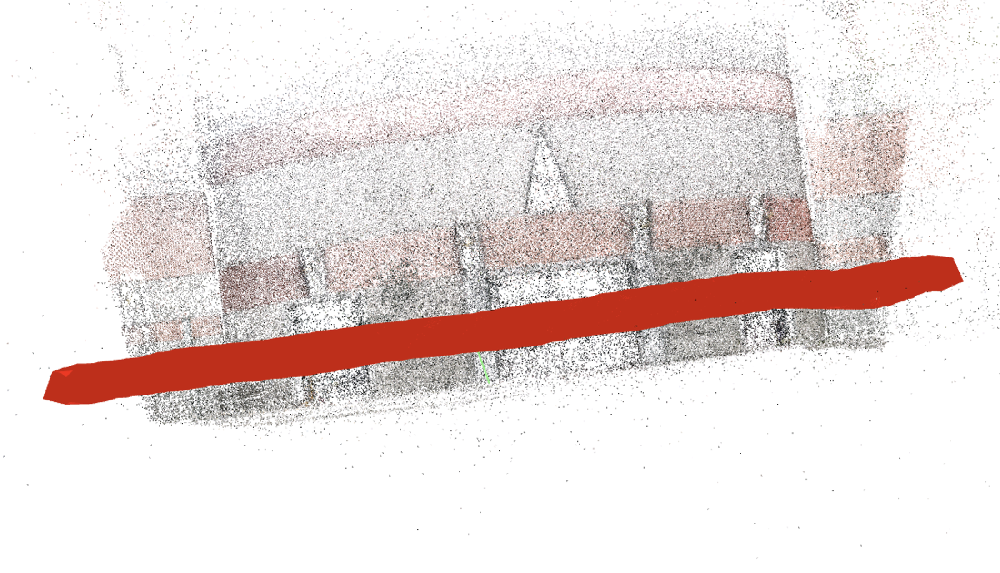
   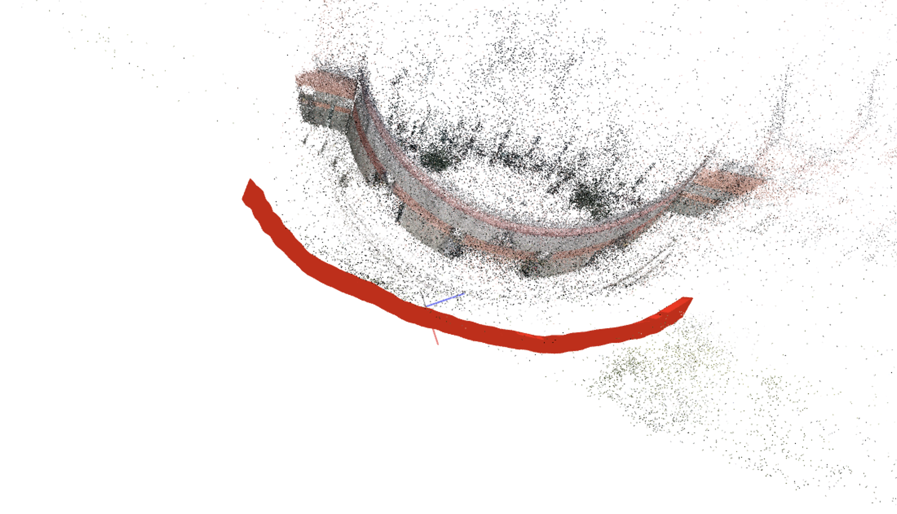
   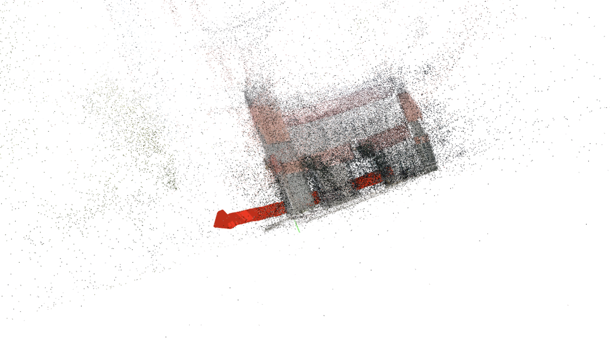
   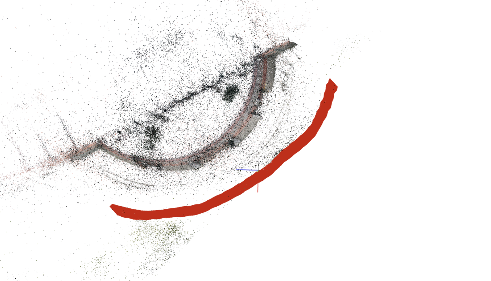
3. Next, I used `Open3D` to convert the sparse point cloud into a mesh. The main approach was to apply Poisson surface reconstruction. The steps I followed are listed below, and the results are shown here:  
    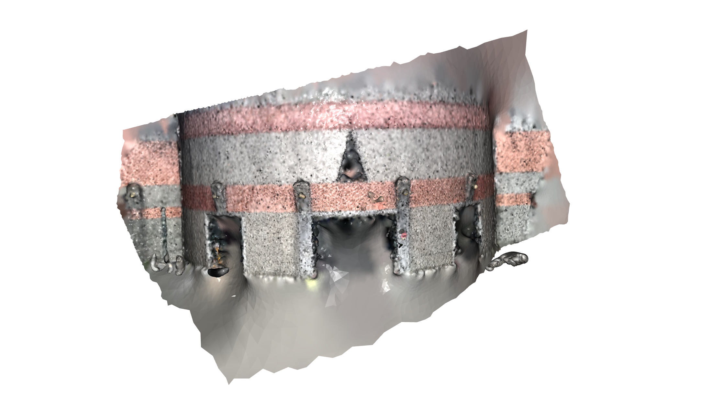
   
   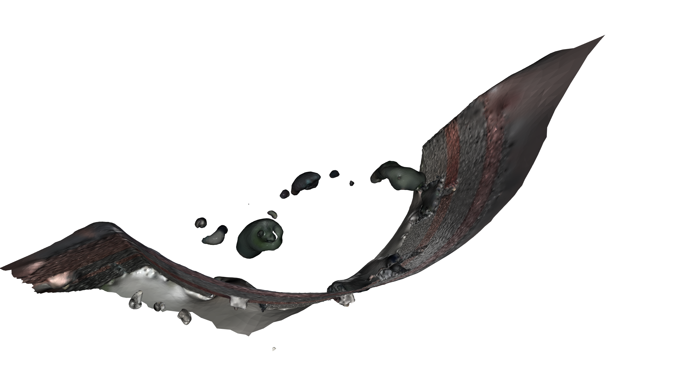
   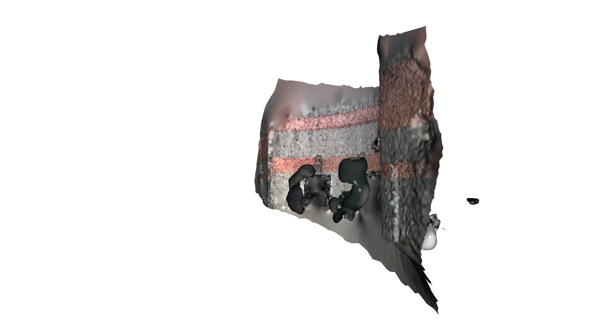

   1. First, I loaded the point cloud and removed outliers using `remove_radius_outlier()` function. This function removes points that have fewer than a specified number of neighbors within a given radius.
      - This step helps to eliminate noise and outliers from the point cloud.
      - The total number of points reduced from around 180k to 120k after this step.
   2. Then, I oriented the normals of the point cloud using `orient_normals_consistent_tangent_plane()` function. This function ensures that the normals of the points are consistently oriented, which is important for surface reconstruction.
   3. Next, I applied Poisson surface reconstruction using `create_from_point_cloud_poisson()` function. This function generates a mesh from the point cloud using the Poisson surface reconstruction algorithm.
   4. Finally, I smoothed the mesh using `filter_smooth_simple()` function. This function applies a simple smoothing algorithm to the mesh to improve its appearance.

### Difficulties Encountered

At the beginning, I did not realize that removing outliers is a crucial step before applying Poisson surface reconstruction. The resulting mesh was noisy and had lots of "floaters".

## Report for Problem 2

### Steps

1. For 2-1, Lowe's ratio test was applied to filter out unreliable matches. The ratio threshold was set to 0.7.
2. Next, I implemented the RANSAC algorithm to estimate the camera pose for each frame. The main steps are as follows:
   1. Randomly sample 4 pairs of matching keypoints.
   2. To solve the P3P problem, I used OpenCV's `cv2.solvePnP` function with the `cv2.SOLVEPNP_AP3P` flag.
   3. The reprojection error was calculated for all matching keypoints using the estimated camera pose. The error threshold was set to 8 pixels.
   4. Steps 1 to 3 were repeated for 2000 iterations. Actually, 500 iterations should be mathematically sufficient, but I did not tune the parameter since the computation time was acceptable.
   5. The camera pose with the highest number of inliers was selected as the final estimate.
3. The above steps were repeated for all frames in the validation sequence. The camera poses were drawn in red pyramids, and the trajectories were drawn in green lines. Here are some visualizations of the estimated poses:  
   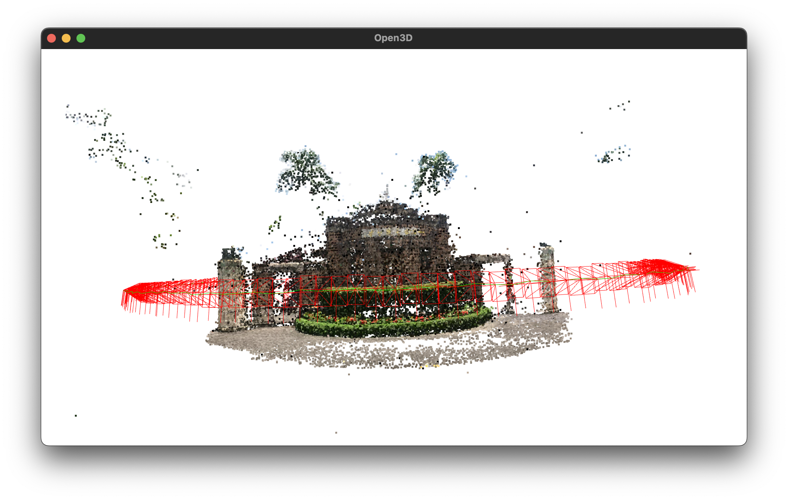
   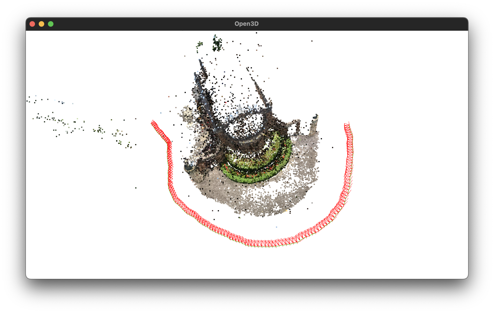
   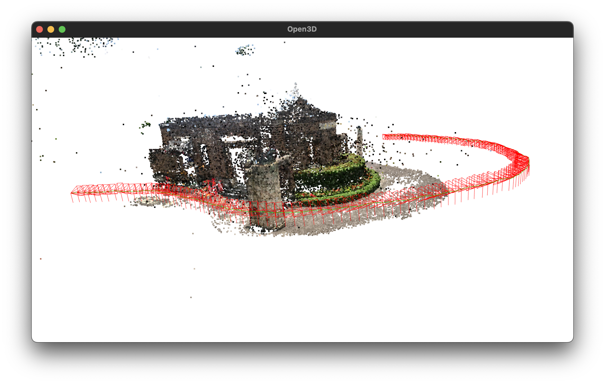
   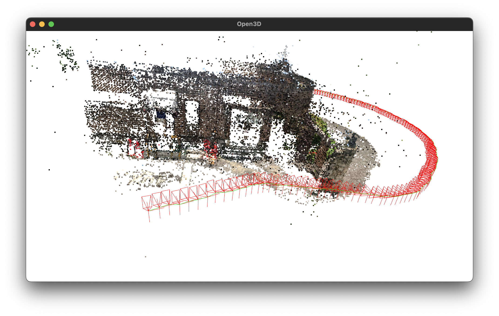
4. For 2-2, the pose error was recorded during the estimation. The median of the pose error was around 0.02 degrees for orientation, and around 5 to 6 pixels for position, which was the same as the results from `cv2.solvePnPRansac`.
5. The extrinsic matrices and intrinsic parameters were stored in a file, which was then used in the 2-3 part.
6. For 2-3, the cube's 3D coordinates were first transformed by the camera extrinsic matrix to the camera coordinate system. Then, the 3D points were projected onto the 2D image plane using the intrinsic matrix.
7. During the projection, I stored the depth information of each point for depth testing. Then I drew the points via painter's algorithm.
8. Finally, I combined all the frames into a video using OpenCV's `cv2.VideoWriter`, the frame rate was set to 15 fps. The video looked good, and the cube was quite stable. Below are some example frames from the output video:  
   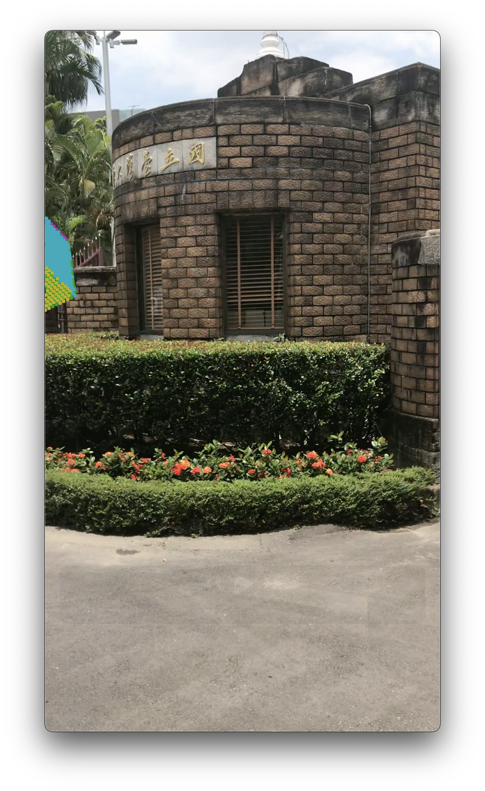
   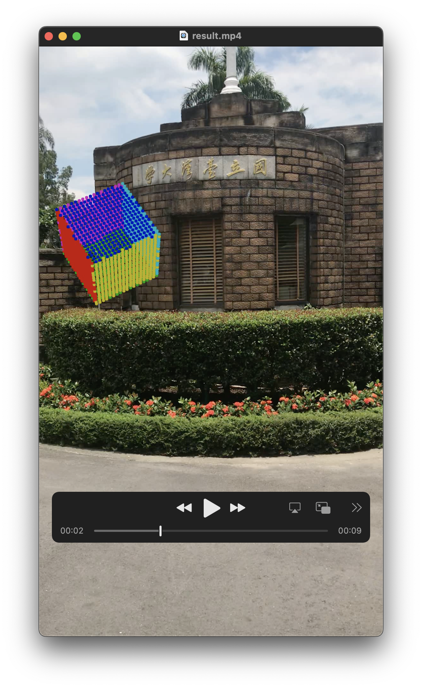
   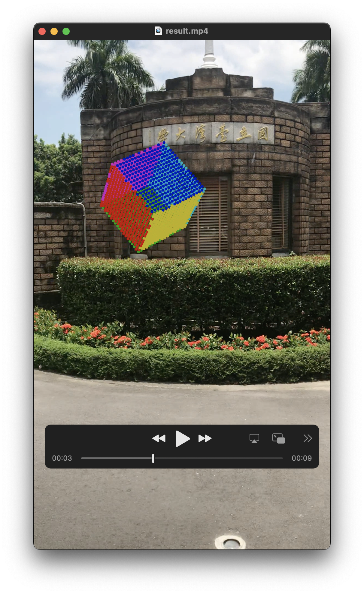
   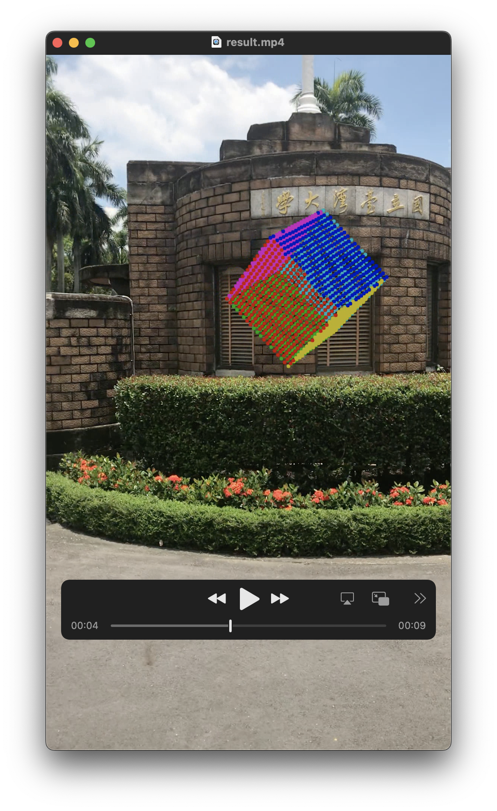
   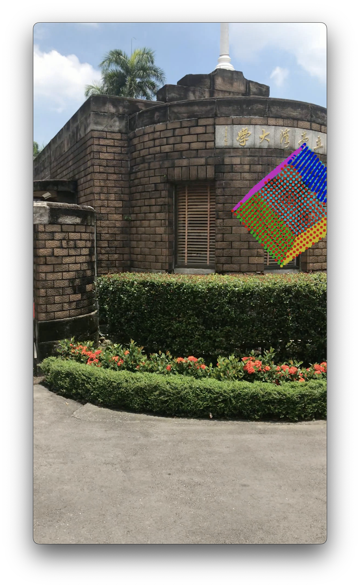
   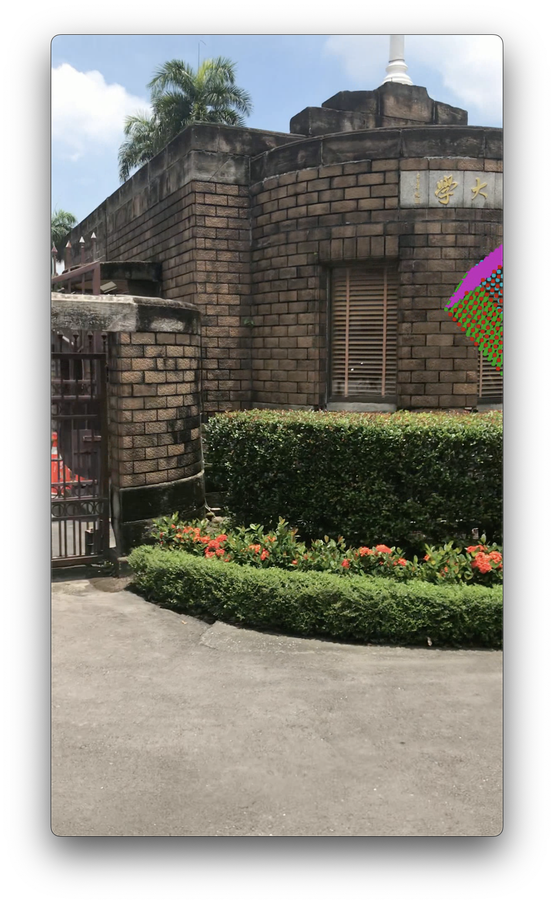

### Difficulties Encountered

1. The process of estimating the camera pose was quite slow. It took around 5 seconds per frame on my machine, and it became slower when screen recording.
   1. I timed the code and found that it was not because of the RANSAC iterations, nor the PnP solving. It might be helpful to parallelize the code.
2. Initially, I did not sort the validation images well, which led to undesirable trajectories. I fixed this by parsing the image filenames and extracting the frame numbers.
3. The shapes of the arrays were not handled properly at the beginning, which caused many bugs. I fixed this via the python debugger and writing proper comments.
4. There were many parameters to pass to the Open3D functions. Luckily, the official documentation was pretty clear and friendly.
